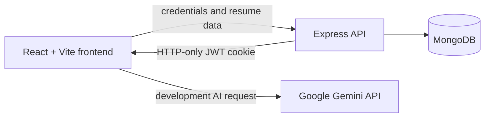

# CVision

CVision is a full-stack resume builder with guided editing, live preview, saved
resume records, theme selection, and Gemini-assisted content generation.


## Features

- Account registration and sign-in with an HTTP-only JWT cookie
- Dashboard for creating and managing multiple resumes
- Guided forms for personal details, summary, experience, projects, education,
  and skills
- Live resume preview while editing
- Configurable resume theme color
- MongoDB persistence with ownership checks on resume operations
- Gemini-assisted resume content
- Shareable resume view

## Architecture



The monorepo uses npm workspaces:

```text
CVison/
├── packages/
│   ├── frontend/   React, Vite, Redux Toolkit, Tailwind CSS
│   └── backend/    Express, Mongoose, JWT authentication
└── package.json
```

## Technology

| Layer | Technology |
| --- | --- |
| Frontend | React 18, Vite, React Router, Redux Toolkit, Tailwind CSS |
| Backend | Node.js, Express, Mongoose |
| Database | MongoDB |
| Authentication | bcrypt, JWT, HTTP-only cookies |
| AI | Google Generative AI SDK |

## Local setup

Requirements:

- Node.js 20 LTS
- npm
- MongoDB
- A restricted Gemini development API key

```bash
git clone https://github.com/saurabh374/CVison.git
cd CVison
npm install
cp packages/backend/.env.example packages/backend/.env
cp packages/frontend/.env.example packages/frontend/.env
npm run dev
```

The frontend runs at [http://localhost:5173](http://localhost:5173), and the
example backend configuration uses [http://localhost:5000](http://localhost:5000).

## Environment variables

Use the checked-in example files as templates:

- `packages/backend/.env.example`
- `packages/frontend/.env.example`

Do not commit real credentials. Variables prefixed with `VITE_` are embedded in
the browser bundle. For a production deployment, proxy Gemini requests through
the backend and keep the API key in server-side configuration.

## API overview

| Method | Route | Purpose |
| --- | --- | --- |
| `POST` | `/api/users/register` | Create an account |
| `POST` | `/api/users/login` | Sign in and set the JWT cookie |
| `GET` | `/api/users/logout` | Clear the session |
| `POST` | `/api/resumes/createResume` | Create a resume |
| `GET` | `/api/resumes/getAllResume` | List the current user's resumes |
| `GET` | `/api/resumes/getResume?id=...` | Load one resume |
| `PUT` | `/api/resumes/updateResume?id=...` | Update one resume |
| `DELETE` | `/api/resumes/removeResume?id=...` | Delete one resume |

## Build

```bash
cd packages/frontend
npm run build
```

## Project status

CVision is a portfolio project. Before production use, move AI requests to the
backend, add request validation and automated tests, use managed secret storage,
and review authentication and CORS settings for the deployment environment.

## Author

[Saurabh Patil](https://saurabh374.github.io/) ·
[LinkedIn](https://linkedin.com/in/iamsaurabhp/)
